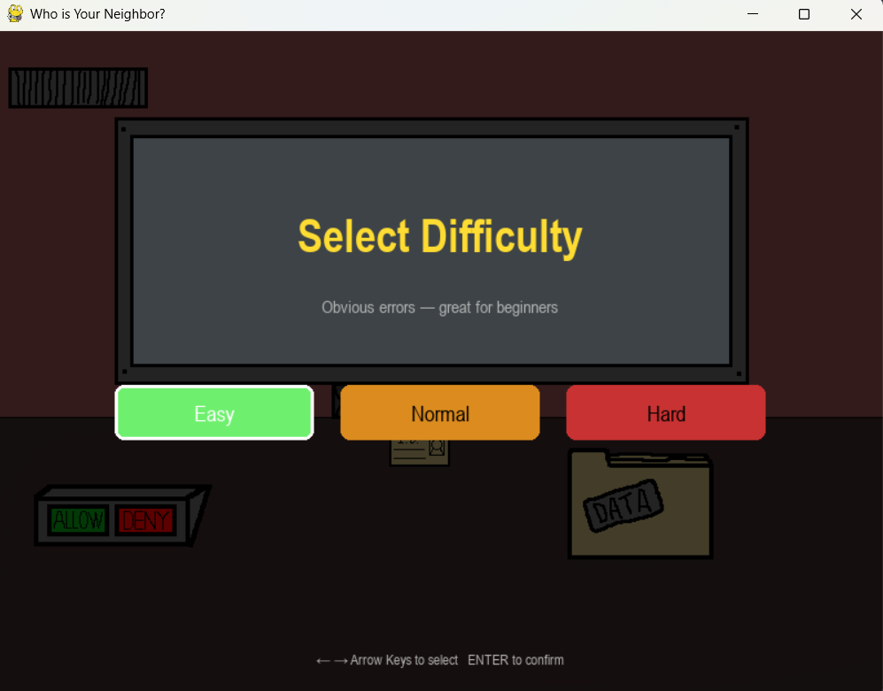
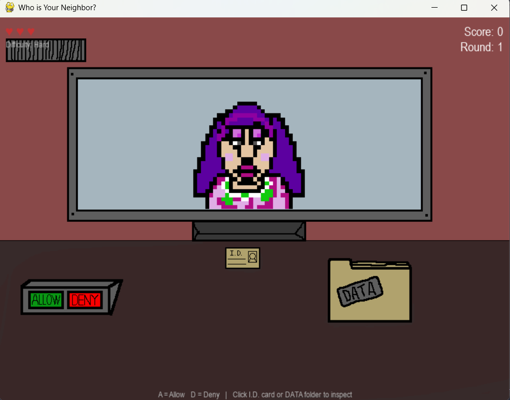
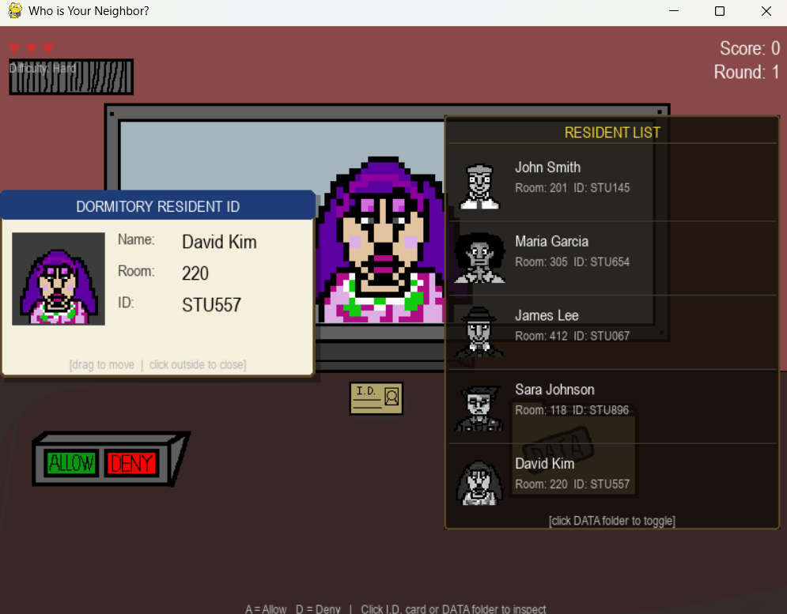
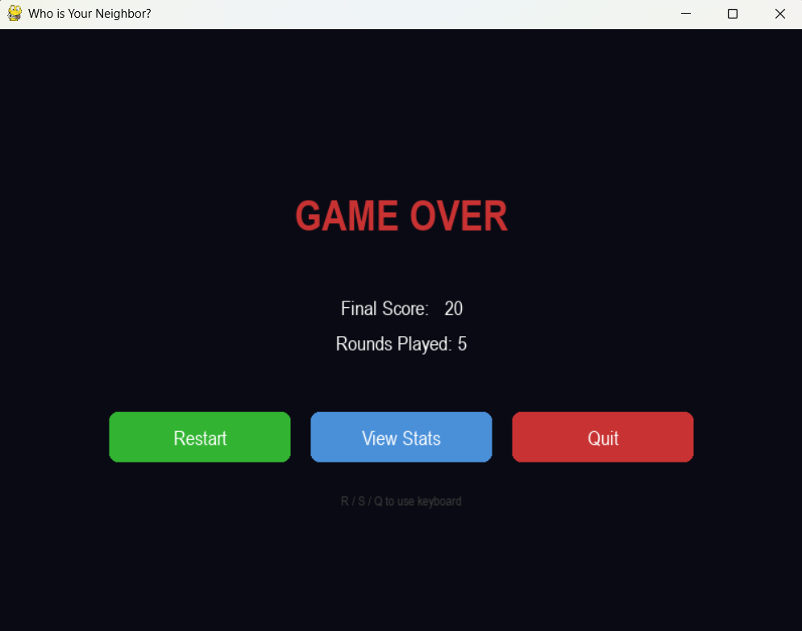
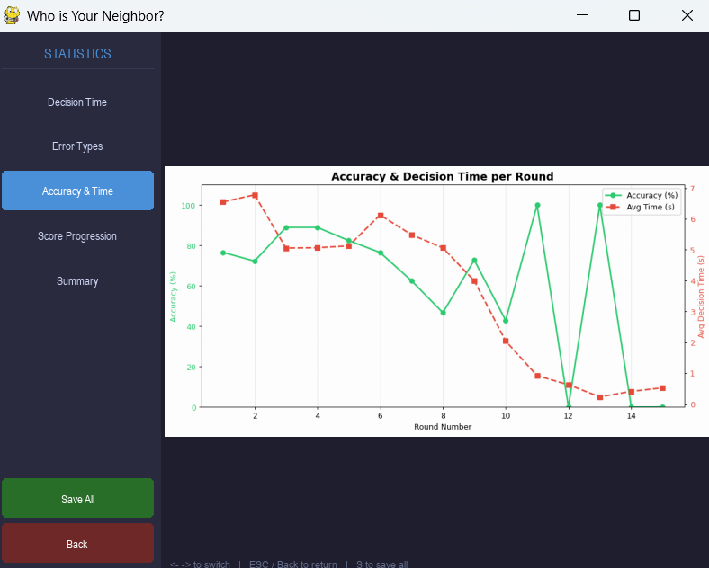
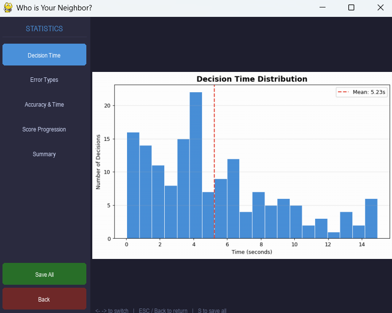
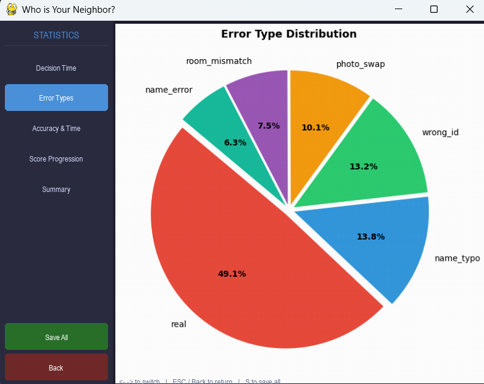
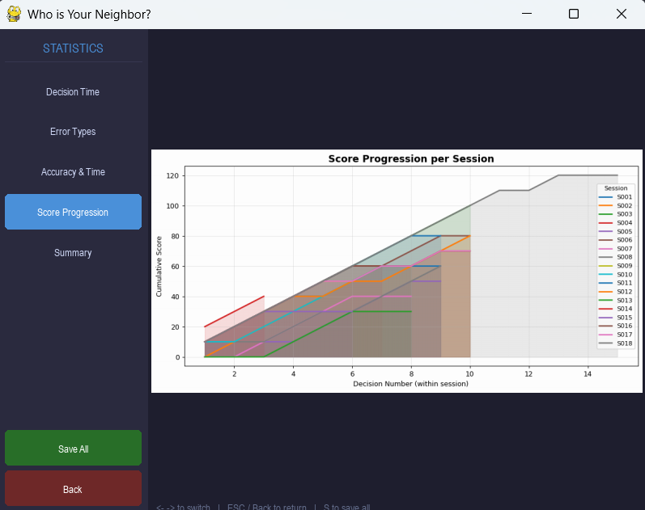
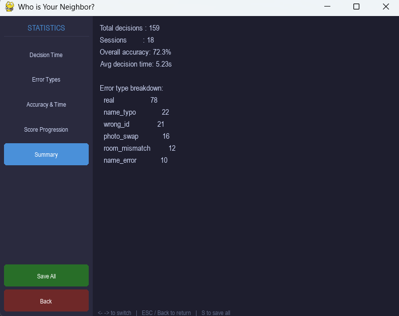

# Project Description

## 1. Project Overview

- **Project Name:** Who is Your Neighbor?

- **Brief Description:**  
  "Who is Your Neighbor?" is a casual single-screen decision-making game built with Python and Pygame. The player takes on the role of a dormitory security guard stationed at the entrance. Each round, a visitor approaches and presents an ID card containing their name, room number, student ID, and photo. The player must cross-reference the card against the resident list panel and decide whether the visitor is a real resident or a disguised doppelganger — then press **ALLOW** or **DENY** to make their call.

  The game tracks all player decisions in real time to a CSV file, and a separate statistics viewer (built with Tkinter and Matplotlib) lets players review their performance through four interactive charts: decision time histogram, error type pie chart, accuracy and time per round, and score progression per session.

- **Problem Statement:**  
  Casual puzzle games often lack meaningful feedback on player performance or skill progression. This project combines a fun doppelganger-detection mechanic with real-time data collection and visualization, giving players insight into their decision speed, accuracy, and the types of errors that fool them most.

- **Target Users:**  
  Casual gamers who enjoy short puzzle sessions, and students or instructors looking for a demonstration of Python OOP, game logic, and data visualization in a single project.

- **Key Features:**
  - Doppelganger detection gameplay with 5 distinct error types: room mismatch, name error, name typo, wrong student ID, and photo swap
  - Draggable ID card overlay for close inspection
  - Resident list panel showing all registered residents with grayscale portrait photos
  - Difficulty selection (Easy / Normal / Hard) with automatic scaling every 5 rounds
  - Per-decision statistics recorded to CSV (decision time, correctness, error type, score)
  - Standalone statistics viewer with 4 charts and a summary panel

- **Screenshots:**

  **Gameplay**

  
  
  
  
  

  **Statistics Viewer**

  
  
  
  
  

- **Proposal:** [Project_Proposal__Chayapol_Kaewsakul.pdf](Project_Proposal__Chayapol_Kaewsakul.pdf)

- **YouTube Presentation:** *(Add link here after recording)*  
  [▶ Watch on YouTube](https://youtu.be/XlhG5lynYME)  
  The video covers: (1) game demonstration and statistics viewer walkthrough; (2) class design explanation; (3) statistics features and data visualizations.

---

## 2. Concept

### 2.1 Background

This project was inspired by the indie game *That's Not My Neighbor*, a doppelganger detection game in which the player acts as a doorman who must identify imposters before allowing them entry. The core tension — carefully comparing details against a reference list under time pressure — is simple to understand but surprisingly engaging.

The project extends this idea into a dormitory setting and adds a structured data layer on top. Where most casual games offer no feedback beyond a final score, this game records every decision and surfaces patterns the player might not notice themselves: Do they take too long on certain error types? Does their accuracy drop after round 10? The statistics viewer makes those patterns visible.

### 2.2 Objectives

- Build a fully playable single-screen game in Python using the Pygame library
- Implement object-oriented design with at least 5 distinct classes, each with clear responsibilities
- Generate a minimum of 100 rows of per-decision gameplay data across sessions
- Visualize the collected data with at least 3 chart types (histogram, pie chart, line chart)
- Demonstrate difficulty scaling, state management, and event-driven input handling in a game context

---

## 3. UML Class Diagram

The class diagram is provided as a PDF in the repository root.

**[UML_Class_Diagram](UML.pdf)**

Class relationships summary:

- `Doppelganger` **inherits** `Resident`
- `GameManager` **uses** `Resident`, `Doppelganger`, and `StatsTracker`
- `UIManager` **uses** `GameManager` and `Resident`
- `main.py` **instantiates** `GameManager` and `UIManager`

---

## 4. Object-Oriented Programming Implementation

- **`Resident`** (`resident.py`) — Stores all data for a real dormitory resident: name, room number, student ID, and photo filename. Provides `_generate_card()` to build the ID card dictionary, `validate()` for input checking, `display_card()` for rendering the card to screen, `to_dict()` for serialization, and `get_result()` which returns `True` (indicating a real resident).

- **`Doppelganger`** (`resident.py`) — Inherits `Resident`. On construction, selects one of five error types and calls `generate_error()` to corrupt the relevant field (room, name, student ID, or photo). Stores the original resident data in `original_data` for comparison. `get_result()` returns `False`. `get_mismatch()` returns a list of all changed fields for debugging.

- **`GameManager`** (`game_manage.py`) — Controls the full game loop: lives, score, round number, and difficulty. Loads the five residents, picks a real resident or doppelganger for each round via `next_round()`, evaluates the player's decision in `check_decision()`, scales difficulty every 5 rounds in `update_difficulty()`, and triggers `StatsTracker.save_to_csv()` at game over.

- **`UIManager`** (`ui_manager.py`) — Handles all Pygame rendering. Draws the visitor character, draggable ID card, resident list panel, HUD (score, lives, round, difficulty), feedback overlay, and hint bar. Also contains the title screen, difficulty selection screen, in-game statistics screen, and game over screen as self-contained loops.

- **`StatsTracker`** (`stats_tracker.py`) — Records per-decision rows in memory and appends them to `gameplay_stats.csv` at session end. Automatically generates sequential session IDs (S001, S002, …). Provides `summarize()` for quick in-session stats.

---

## 5. Statistical Data

### 5.1 Data Recording Method

Data is recorded at the **per-decision level** — one row is written every time the player presses ALLOW or DENY. Recording happens inside `GameManager.check_decision()`, which calls `StatsTracker.record_decision()` immediately after evaluating the player's choice. At game over, `StatsTracker.save_to_csv()` appends all rows from the current session to `gameplay_stats.csv` using Python's built-in `csv` module. The file is created with a header row on first run and appended on subsequent runs, so data accumulates across sessions.

A single 20-round session produces 20 rows. Five sessions exceed the 100-row requirement comfortably.

### 5.2 Data Features

| Feature | Description | Type | Example |
|---|---|---|---|
| `session_id` | Auto-incremented session identifier (S001, S002, …) | String | `S003` |
| `round_number` | Round number within the session | Integer | `12` |
| `decision_time` | Seconds elapsed from visitor appearance to player decision | Float | `4.32` |
| `is_correct` | Whether the player's decision was correct (1 = correct, 0 = wrong) | Integer | `1` |
| `error_type` | Doppelganger error type presented, or `"real"` if visitor was genuine | String | `room_mismatch` |
| `score_at_decision` | Player's cumulative score at the moment of the decision | Integer | `110` |

### 5.3 Visualizations

The statistics viewer (`generate_graphs.py`) provides four charts:

1. **Decision Time Histogram** — Distribution of all decision times with mean line
2. **Error Type Pie Chart** — Proportion of each error type (including `real`) across all sessions
3. **Accuracy & Decision Time per Round** — Dual-axis line chart showing accuracy % and average decision time as rounds progress
4. **Score Progression per Session** — Area line chart showing cumulative score over decisions, one line per session

---

## 6. Changed Proposed Features

- **`Visitor` class removed** — The original proposal included a separate `Visitor` class to represent the current person at the door. After TA feedback, this was removed. Its responsibilities (`display_card()`, `get_result()`) were merged directly into `Resident` and `Doppelganger`, which already held all the necessary data. `isinstance(visitor, Doppelganger)` is used where a type check is needed.

- **`floor` attribute not implemented** — The proposal listed `floor` as a `Resident` attribute. It was omitted from the final implementation as room number alone provides sufficient information for the doppelganger mechanic without adding visual clutter to the ID card.

- **Difficulty expanded from 2 to 3 levels** — The proposal described only Easy and Hard modes. The final implementation has three levels (Easy, Normal, Hard) to provide a more gradual difficulty curve. Difficulty also scales automatically every 5 rounds during a session, regardless of the starting level chosen by the player.

- **Error types mapped explicitly per difficulty** — The proposal described difficulty in general terms ("more subtle errors at higher levels"). In the final implementation, each difficulty level uses a specific set of error types: Easy uses only `name_error` and `photo_swap` (obvious visual differences); Normal uses `room_mismatch` and `wrong_id` (require careful reading); Hard uses `name_typo`, `room_mismatch`, `wrong_id`, and `photo_swap` with weighted probabilities (45 / 30 / 20 / 5) to favour the hardest-to-spot errors.

- **`expired_id` error type not implemented** — The proposal listed "expired ID" as one of the doppelganger error types. This was dropped in the final implementation because it would require adding an expiry date field to the ID card UI, which added complexity without contributing meaningfully to the core detection mechanic. The five implemented error types already provide sufficient variety.

---

## 7. External Sources

**Gameplay Inspiration**
- *That's Not My Neighbor* by Nacho Sama — core doppelganger detection concept  
  [https://nachosama.itch.io/thats-not-my-neighbor](https://nachosama.itch.io/thats-not-my-neighbor)

**Libraries Used**
- [Pygame 2.6.1](https://www.pygame.org/) — game window, rendering, event handling (LGPL)
- [pandas](https://pandas.pydata.org/) — CSV loading and data aggregation for stats viewer (BSD 3-Clause)
- [matplotlib](https://matplotlib.org/) — chart rendering in stats viewer (PSF-based license)
- Python standard library: `csv`, `os`, `time`, `random`, `copy`, `tkinter`

**Art Assets**
- Character face sprites (`stu001.png` – `stu005.png` and `_dop` variants): drawn by Chayapol Kaewsakul using [Piskel](https://www.piskelapp.com/)
- Background image (`Black_ground.png`): created by Chayapol Kaewsakul
